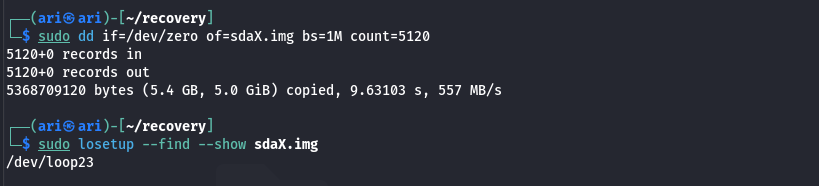

# Incident Recreation: Directory Hidden by Mounted Filesystem
This phase simulates a real-world incident where a 600GB directory (d_harddrive) was accidentally overwritten by another filesystem mount.
The goal is to practive recovery techniques in a safe environment.
**Note:** The original directory is hidden, not deleted, when a filesystem is mounted on top.

 1. Environment setup:
**Disk image creation:**

2. Partitioning the Fake Disk:
We create a GPT partition table and a single ext4 partition on the fake disk.
this mirrors how real disk are typically structured.

3. Mapping the Partition:
We use kpartx to map the partition to a device in /dev/mapper/.
This allows us to work with it as if it were a real block device.
-screenshot 3 kpartx and ls -l /dev/mapper/loop23p1-

4. Creating the Filesystem:
We format the partition as ext4 and mount it, creating a safe environment for our simulated data.
lost+found is created automatically by ext4.
-screenshot 4 for filesystem creation mkfs:ls /mnt/data_vol-

5. Creating the Original Directory (d_harddrive):
We simulate the 600GB directory with smaller files for practicality.
This represents the directory that will later be accidentally overlayed.
-screenshot 5 for cd /mnt/data_vol:ls -R /mnt/data_vol/d_harddrive-

6. Simulation the Overlayed (Accidental Mount):
We now simulated the mistake, mouting a new filesystem over the original directory.
this represents creating the overlay filesystem:
-screenshot 6 for creation evildisk.img:mkfs.ext4-

this represents the cursed mistake I've made (the bright side, I see it as a chance to learn more)

and at this point, d_harddrive is hidden becuase the new filesystem is mounted over /mnt/data_volume, Note: the original files still exist inside sdaX.img, but are not visible until the overlay is removed.
