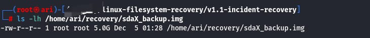
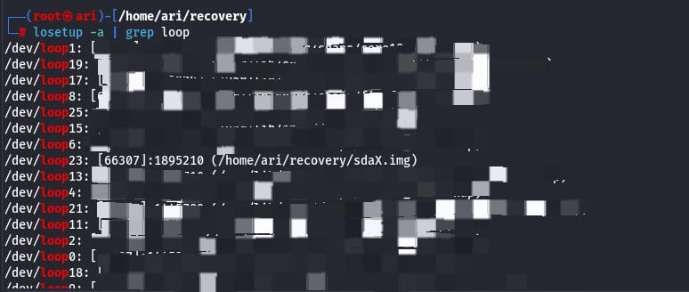

## Incident Recovery: Directory Hidden my Mounted Filesystem
This phase demonstrates the recovery of the directory ('d_harddrive') that was hidden due to an accidental overlay of a new filesystem on top of the original directory. The goal is to practice safe recovery techniques for the incident we've recreated in the v1.0-incident-recreation section without harming the original data on my/your system.
**Note:** The original directory is **not deleted**, only hidden when the overlaying filesystem is mounted. Recovery is performed from a **backup disk image** to ensure safety.


**0. Backup Preparation**
Before starting the recovery process, we create a backup of the original disk image ('sdaX.img') to ensure data integrity.



**1. Attach the Disk Image as a loop Device**
We attach the backup disk image to a loop device using *losetup*. This allows us to interact with it as if it were a real block device.
```losetup -fP sdaX_backup.img```


**2. Map the Partition**
We use ```kpartx``` to create device mappings for the partitions inside the disk image. This maps each partition to */dev/mapper/*.


**3. Check Filesystem Consistency**
Before mounting, we perform a read-only filesystem check using ```fsck.ext4``` to verify that the partition is clean.


**4. Mount the Partition in Read-Only Mode**
To safely access the hidden directory without risk of modifying it, we mount the mapped partition read-only.


**5. Explore the Hidden Directory**
We recursively list the hidden directory to verify the contents.


**6. Copy Recovered Data**
We safely copy the hidden directory to a local recovery folder to work with it without modifying the original image.


**7. Clean Up Mounts and Mappings**
After recovery, we unmount the partition and remove the loop device mappings to avoid accidental modifications.


##⚠️ Things I have avoided while recoverying and recreation for the incident ⚠️##
These steps were only for learning purposes and to avoid having a tragic learning practice XD. I**Never** apply these steps to real disks.
- Always work on a disk image or backup.
- Use read-only mounts for verification whenever possible.
- Keep clear backups before performing destructive commands like 'mkfs' or 'mount --bind'.
- Follow the steps in the v1.0-incident-recreation branch for exact commands and screenshots.

